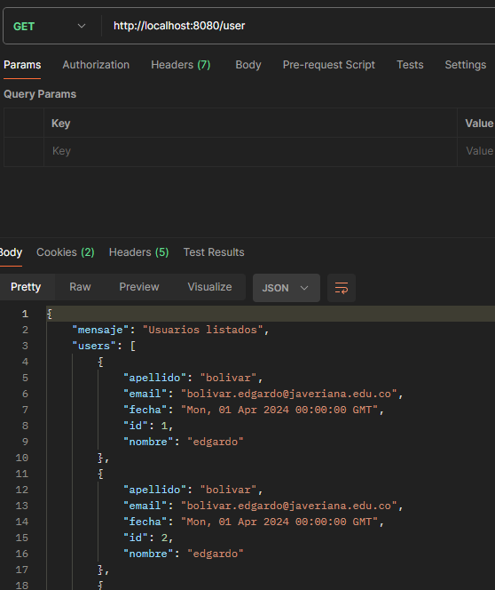
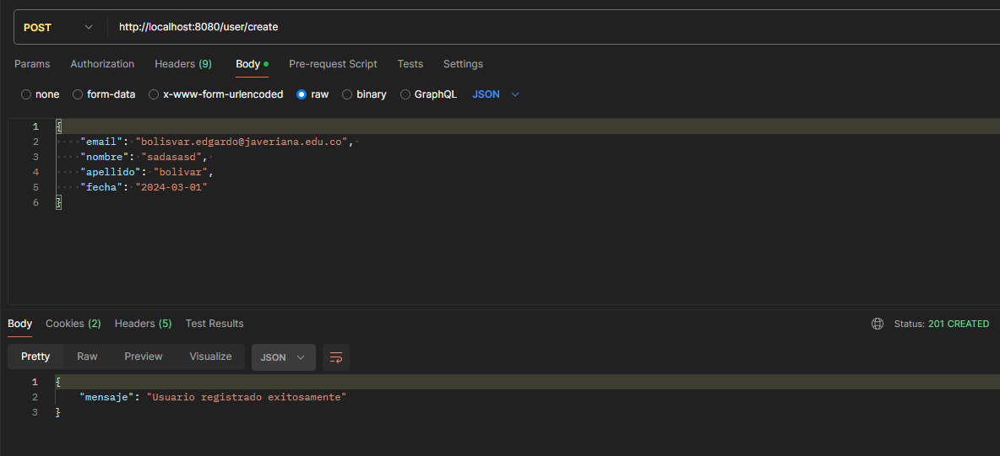

# README #

Este README documentará todos los pasos necesarios para poner en marcha esta aplicación.

## Requisitos
- docker 
- docker compose (opcional)

## Pasos (manual)
1. docker network create ms-network
2. docker build -t ms-mysql ./docker/mysql/
3. docker run -d --name ms-mysql --network ms-network -e MYSQL_ROOT_PASSWORD=TOOR -e MYSQL_DATABASE=pica -e MYSQL_USER=pica -e MYSQL_PASSWORD='AZ92adx!!!' -p 3306:3306 -v ./database_mysql:/var/lib/mysql:rw ms-mysql --default-authentication-plugin=mysql_native_password
4. Create table:  
docker exec -i ms-mysql mysql -u pica -D pica -p'AZ92adx!!!' -e "source /backup.sql"

5. docker build -t ms-app ./app/
6. docker run -d --name ms-app --network ms-network -e MYSQL_HOST=ms-mysql -e MYSQL_DB=pica -e MYSQL_PORT=3306 -e MYSQL_USER=pica -e MYSQL_PASSWORD='AZ92adx!!!' -p 8080:9000 -v database_mysql:/var/lib/mysql:rw ms-app

## Pasos (docker compose)
1. docker network create ms-network
2. docker-compose up -d --build
3. Create table:  
docker exec -i ms-mysql mysql -u pica -D pica -p'AZ92adx!!!' -e "source /backup.sql"

## Ejemplos
- Consultar usuarios registrados  
[Get] http://localhost:8080/user  

- Crear usuario  
[POST] http://localhost:8080/user/create
